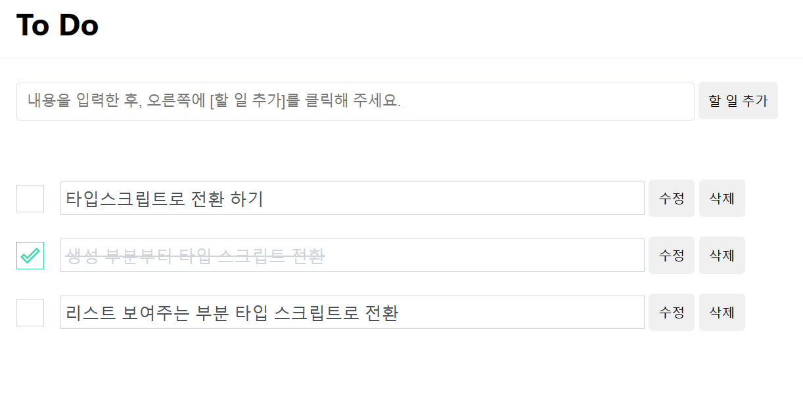

# \* Todo 사전 과제

## 1. 프로젝트 구조 소개

### 1.1 디렉토리 구조

    src/
        |-- App.tsx
        |-- components/
        |   |-- TodoHead.tsx
        |   |-- TodoList/
        |   |   |
        |   |   |-- TodoItem.tsx
        |   |
        |   |-- CreateTodo.tsx
        |-- api/ todos.js

### 1.2 디렉토리 설명

    📌 TodoHead

    TodoHead는 헤더를 담당하는 컴포넌트입니다.

    📋 TodoList

    TodoList는 투두 리스트 목록을 랜더링해주는 컴포넌트입니다. 이 컴포넌트는 TodoItem을 여러 개 포함하며, 각 투두 아이템들을 보여줄 것입니다.

    ✅ TodoItem

    TodoItem은 단일 투두를 담당하는 컴포넌트입니다. 각 투두 아이템은 수정과 삭제 기능을 제공하며, 여기서 사용자의 상호작용을 처리할 것입니다.

    ➕ CreateTodo

    CreateTodo는 투두를 추가하는 기능을 담당하는 컴포넌트입니다. 사용자가 새로운 투두를 입력하고 추가 버튼을 누르면 이 컴포넌트에서 해당 정보를 처리하여 투두 목록에 추가됩니다.

    📡 api/ todos.js

    api/todos.js 파일은 CRUD (Create, Read, Update, Delete) API 요청을 다루는 함수들을 모아놓은 파일입니다. 서버와의 통신을 담당하여 투두 데이터의 생성, 조회, 수정, 삭제를 처리합니다.

## 2. 구현 방법에 대한 설명

### 2-1. 상태 관리 및 컴포넌트 구조:

#### 상태 관리:

        App 컴포넌트는 애플리케이션 진입점으로 TodoProvider로 컨텍스트를 제공합니다. 이를 통해 상태를 관리하고 하위 컴포넌트에 전달합니다.
        컴포넌트는 자체적으로 상태를 관리하지 않고, 필요한 상태는 컨텍스트에서 제공받아 사용합니다.

#### SPA 구현 방법:

        TodoList 컴포넌트는 투두 리스트를 랜더링하고, TodoItem 컴포넌트를 포함합니다. TodoList는 useEffect를 사용하여 초기 데이터를 서버에서 가져옵니다. 디스패치에 반응하여 새로운 투두 목록들을 랜더링 하는 식으로 구현 했습니다.
        TodoItem 컴포넌트는 단일 투두 아이템을 랜더링하고 수정, 삭제 기능을 처리합니다.
        CreateTodo 컴포넌트는 새로운 투두를 추가하는 기능을 구현했습니다.

#### API 요청 처리:

        api/todos.js 파일에는 투두 관련 CRUD 작업을 처리하는 함수들이 정의됩니다. 이 함수들은 axios를 사용하여 서버와 통신합니다.
        예를 들어, createTodoApi 함수는 새로운 투두를 생성하는 요청을 보내고, getFetchTodos 함수는 투두 리스트를 가져오는 요청을 보냅니다.
        투두의 추가, 수정, 삭제:

        TodoList 컴포넌트에서는 TodoItem 컴포넌트를 여러 개 랜더링하며, 각 TodoItem은 props로 투두 정보를 받아 랜더링합니다.
        TodoItem 컴포넌트는 수정과 삭제 버튼을 가지고 있으며, 클릭 시 해당 작업을 처리합니다.

## 3. 개발 환경

    - node: v18.17.0
    - Visual Studio Code
    - git version 2.35.1.windows.2
    - \mailplug
    ├─┬ @testing-library/react@13.4.0
    │ └── react@18.2.0 deduped
    ├─┬ react-dom@18.2.0
    │ └── react@18.2.0 deduped
    ├─┬ react-icons@4.10.1
    │ └── react@18.2.0 deduped
    ├─┬ react-scripts@5.0.1
    │ └── react@18.2.0 deduped
    ├── react@18.2.0
    └─┬ styled-components@6.0.7
    └── react@18.2.0 deduped

## 4. 빌드 및 실행

- npm i
- docker run -d -p 8080:8080 mailplug/todo-api
- npm build
- npm start

## 5. 기타 설명

- 실행 모습
  
